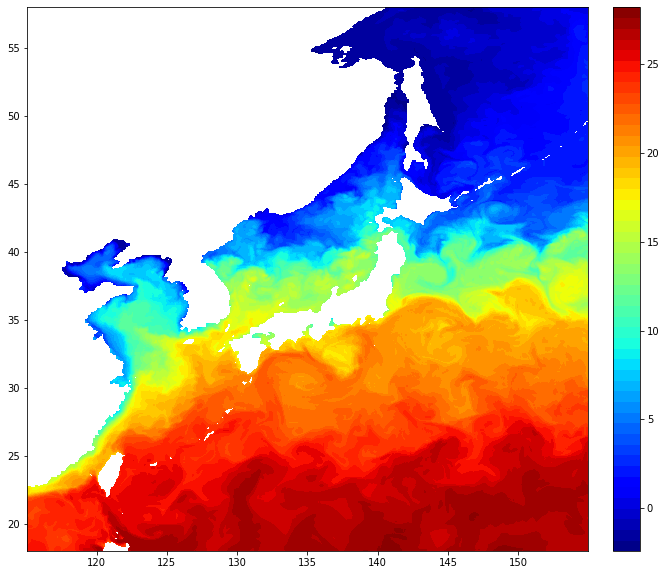
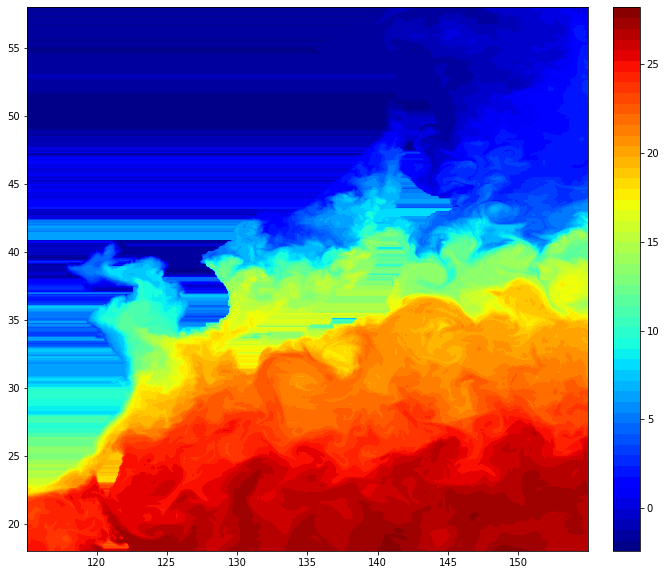
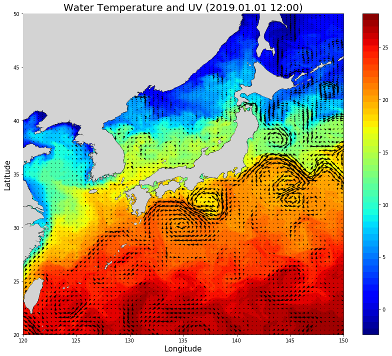

NetCDF4 데이터를 읽어서 다음과 같이 가시화해보겠다.


사용 데이터는 Hycom 재분석 자료이며, 관련 링크는 다음과 같다.
- Hycom 자료 설명 : https://www.hycom.org/
- Hycom 자료 FTP : ftp://ftp.hycom.org/datasets/GLBv0.08/expt_93.0/data/hindcasts/2020/

파일의 마지막에 ts3z라 적혀 있으면 수온 및 염분 데이터, uv3z는 유속 UV 데이터이다. 그리고 ssh는 수위이다.

우리가 가시화하고자 하는 데이터는 수온과 UV를 사용하므로 이 두가지를 저장하자.

시간대는 아무거나 상관없다.

## Basemap 설치
Basemap은 지도 데이터를 담은 파이썬 라이브러리이다.

CMD에 다음의 명령어로 라이브러리를 설치해준다.

conda 대신 pip를 사용해도 된다.
```console
conda install -y -c conda-forge basemap geos proj4 basemap-data-hires
```

## NetCDF4 설치
NetCDF4 파일을 읽기 위해서는 NetCDF4를 읽을 수 있는 라이브러리가 필요하다.

마찬가지로 설치하도록 하자.
```console
conda install -c anaconda netcdf4
```

## NetCDF4 파일 읽기

NetCDF4 모듈의 설명서는 다음의 링크에 있다.
- NetCDF4 API documentation : https://unidata.github.io/netcdf4-python/netCDF4/index.html

위의 링크를 참조하면 NetCDF4 파일을 다음과 같이 읽거나 쓸 수 있다고 한다.
```python
>>> from netCDF4 import Dataset
>>> rootgrp = Dataset("test.nc", "w", format="NETCDF4")
>>> print(rootgrp.data_model)
NETCDF4
>>> rootgrp.close()
```

우리는 데이터를 읽고자 하므로 ```"w"```가 아닌 ```"r"```로 바꿔주자.

이 후 한번 출력해보면 다음과 같이 나온다.

```python
>>> from netCDF4 import Dataset
>>> nc_data = Dataset("hycom_glbv_930_2019010112_t000_ts3z_r.nc", "r", format="NETCDF4")
>>> print(nc_data)

<class 'netCDF4._netCDF4.Dataset'>
root group (NETCDF3_64BIT_OFFSET data model, file format NETCDF3):
    classification_level: UNCLASSIFIED
    distribution_statement: Approved for public release. Distribution unlimited.
    downgrade_date: not applicable
    classification_authority: not applicable
    institution: Naval Oceanographic Office
    source: HYCOM archive file
    history: Wed Sep 18 16:05:41 2019: ncks -d lon,115.,155. -d lat,18.,58. hycom_glbv_930_2019010112_t000_ts3z.nc hycom_glbv_930_2019010112_t000_ts3z_r.nc
archv2ncdf3z
    field_type: instantaneous
    Conventions: CF-1.6 NAVO_netcdf_v1.1
    NCO: 4.7.2
    dimensions(sizes): depth(40), lat(726), lon(500), time(1)
    variables(dimensions): float64 depth(depth), float64 lat(lat), float64 lon(lon), int16 salinity(time,depth,lat,lon), int16 salinity_bottom(time,lat,lon), float64 tau(time), float64 time(time), int16 water_temp(time,depth,lat,lon), int16 water_temp_bottom(time,lat,lon)
    groups: 

```

파일의 기본적인 정보(메타 데이터)가 전부 나오는데, 예를 들면 차원은 **깊이, 위도, 경도, 시간** 총 4개이며, 깊이는 40개, 위도는 726개, 경도는 500개, 시간은 1개가 있다는 것을 알 수 있다. 또한, 이 파일이 가지고 있는 데이터로는 **깊이, 위도, 경도 이외에도 염분, 해저 염분, 시간 간격, 시간, 수온, 해저 수온**이 있다.

우리가 필요한 것은 해수면 온도이므로, depth를 한 번 살펴보자

depth의 메타 데이터는 다음과 같이 볼 수 있다.
```python
>>> print(nc_data['depth'])
<class 'netCDF4._netCDF4.Variable'>
float64 depth(depth)
    long_name: Depth
    standard_name: depth
    units: m
    positive: down
    axis: Z
    NAVO_code: 5
unlimited dimensions: 
current shape = (40,)
filling on, default _FillValue of 9.969209968386869e+36 used
```

또한, 데이터는 다음과 같이 뽑아볼 수 있다.
```python
>>> print(nc_data['depth'][:])
[0.00e+00 2.00e+00 4.00e+00 6.00e+00 8.00e+00 1.00e+01 1.20e+01 1.50e+01
 2.00e+01 2.50e+01 3.00e+01 3.50e+01 4.00e+01 4.50e+01 5.00e+01 6.00e+01
 7.00e+01 8.00e+01 9.00e+01 1.00e+02 1.25e+02 1.50e+02 2.00e+02 2.50e+02
 3.00e+02 3.50e+02 4.00e+02 5.00e+02 6.00e+02 7.00e+02 8.00e+02 9.00e+02
 1.00e+03 1.25e+03 1.50e+03 2.00e+03 2.50e+03 3.00e+03 4.00e+03 5.00e+03]
 ```
해수면은 0번째 index에 있는 것을 알 수 있다.

```python
nc_data = Dataset("hycom_glbv_930_2019010112_t000_ts3z_r.nc", "r", format="NETCDF4")
nc_data2 = Dataset("hycom_glbv_930_2019010112_t000_uv3z_r.nc", "r", format="NETCDF4")

depth = nc_data['depth'][:]             ## 수심
lat = nc_data['lat'][:]                 ## 위도
lon = nc_data['lon'][:]                 ## 경도

water_temp = nc_data['water_temp'][:]   ## 수온 데이터
sal = nc_data['salinity'][:]            ## 염분 데이터
water_u = nc_data2['water_u'][:]        ## 유향/유속 U
water_v = nc_data2['water_v'][:]        ## 유향/유속 V

water_temp = water_temp[0,0]
water_u = water_u[0,0]
water_v = water_v[0,0]

lon, lat = np.meshgrid(lon, lat)
```

## 수온 가시화

```python
import matplotlib.pyplot as plt
fig, ax = plt.subplots(1, 1, figsize=(11,10))
fig.patch.set_facecolor('w')

# 수온 Contourf
water_temp_plot = ax.contourf(lon, lat, water_temp, levels=50, cmap='jet')
fig.colorbar(water_temp_plot, ticks=list(range(0,31,5)))
plt.show()
```


## 유속, 유향 가시화

여기에 UV를 추가해주자
```python
ax.quiver(lon, lat, water_u, water_v, pivot='mid', scale=40)
plt.show()
```
다만 이렇게 하면 quiver가 너무 많아서 그림이 지저분해지므로 step을 주자

```python
step = 5
ax.quiver(lon[::step,::step], lat[::step,::step],
           water_u[::step,::step], water_v[::step,::step],
           pivot='mid', scale=40, )
plt.show()
```


꽤나 이쁘게 보인다.

이제 여기에 지도를 추가해줄 것이다.
```python
from mpl_toolkits.basemap import Basemap
m = Basemap(projection='cyl',llcrnrlat=20,urcrnrlat=55,\
            llcrnrlon=120,urcrnrlon=150,resolution='l')
m.drawcoastlines()
m.fillcontinents(color='lightgray')
```


그런데 러시아쪽에 강이나 호수가 보이는데, 이게 꽤나 거슬린다.
어떻게 하면 지울 수 있을까 하다 다음과 같은 글을 보았다.

> If you want to stick with Basemap, get a shapefile which doesnt contain the rivers. Natural Earth for example has a nice 'Land' shapefile in the physical section (download 'scale rank' data and uncompress). See http://www.naturalearthdata.com/downloads/10m-physical-vectors/
> 
> (링크 https://stackoverflow.com/questions/14280312/world-map-without-rivers-with-matplotlib-basemap)

요약하자면, Basemap은 쓰고 싶은데 강은 보기 싫으면 위의 링크로 들어가 'Land' shapefile을 다운받으라고 한다. 위의 링크에 들어가면 Land가 보이는데, 위의 글 처럼 **scale rank**를 다운받지 말고 **land**를 다운받도록 하자. 다운받았으면 코드 위치에 넣고, 다음과 같은 코드를 추가해준다.

```python
from matplotlib.collections import PathCollection
from matplotlib.path import Path
shp_info = m.readshapefile('10m/ne_10m_land', 'scalerank')

paths = []
for line in shp_info[4]._paths:
    paths.append(Path(line.vertices, codes=line.codes))
coll = PathCollection(paths, linewidths=0, facecolors='lightgrey', zorder=100)

ax.add_collection(coll)
```

```shp_info = m.readshapefile('10m/ne_10m_land', 'scalerank')```의 파일 경로부분에 자신이 다운로드한 10m land 데이터의 위치를 적으면 되겠다.

위의 코드를 한 곳에 모아두면 다음과 같은 코드와 결과물이 나온다.
```python
from mpl_toolkits.basemap import Basemap
from netCDF4 import Dataset
import matplotlib.pyplot as plt
import matplotlib.image as mpimg
import numpy as np

nc_data = Dataset("hycom_glbv_930_2019010112_t000_ts3z_r.nc", "r", format="NETCDF4")
nc_data2 = Dataset("hycom_glbv_930_2019010112_t000_uv3z_r.nc", "r", format="NETCDF4")
 
depth = nc_data['depth'][:]
lon = nc_data['lon'][:]
lat = nc_data['lat'][:]

water_temp = nc_data['water_temp'][:]
sal = nc_data['salinity'][:]
water_u = nc_data2['water_u'][:]
water_v = nc_data2['water_v'][:]

water_temp = water_temp[0,0]
water_u = water_u[0,0]
water_v = water_v[0,0]

lon, lat = np.meshgrid(lon, lat)

fig, ax = plt.subplots(1, 1, figsize=(11,10))
fig.patch.set_facecolor('w')

# 수온 Contourf
water_temp_plot = ax.contourf(lon, lat, water_temp, levels=50, cmap='jet')
fig.colorbar(water_temp_plot, ticks=list(range(0,31,5)))

# 유속 Quiver
step = 5
ax.quiver(lon[::step,::step], lat[::step,::step],
           water_u[::step,::step], water_v[::step,::step],
           pivot='mid', scale=40, )

# Basemap을 사용한 지도
from mpl_toolkits.basemap import Basemap
m = Basemap(projection='cyl',llcrnrlat=20,urcrnrlat=55,\
            llcrnrlon=120,urcrnrlon=150,resolution='l')
m.drawcoastlines()
m.fillcontinents(color='lightgray',lake_color='aqua')

# 강, 호수 없애기
from matplotlib.collections import PathCollection
from matplotlib.path import Path
shp_info = m.readshapefile('10m/ne_10m_land', 'scalerank')
paths = []
for line in shp_info[4]._paths:
    paths.append(Path(line.vertices, codes=line.codes))
coll = PathCollection(paths, linewidths=0, facecolors='lightgrey', zorder=100)
ax.add_collection(coll)
####

ax.set_xlim(120,150)
ax.set_ylim(20,50)
ax.set_xticks(range(120,151,5))
ax.set_yticks(range(20,51,5))

plt.show()
```


사용한 NetCDF4 데이터가 Basemap의 육지 데이터와 완벽하게 맞아떨어지지 않아서 중간중간에 흰색 빈 칸이 있는 것을 알 수 있다. 이를 지우고자 한다면 외삽(Extrapolation)을 해줘야 할텐데, 다음과 같은 코드로 가능하다.
```python
## Interpolation & Extrapolation
import pandas as pd
df = pd.DataFrame(water_temp)
print(df)
df = df.fillna(method='ffill', axis=1)
df = df.fillna(method='bfill', axis=1)
water_temp = df.values
```
다행히도 `Pandas`라는 모듈에 내삽과 외삽을 해주는 함수가 있다.

이후 `Pandas`에 대해 자세히 다루겠다만, `Pandas`는 오픈소스 데이터 분석 및 조작 도구이다.

데이터베이스 상에 값이 없는 일은 흔하며, 이를 채우기 위해 fillna라는 함수를 제공한다.

다음의 코드를 넣은 후 water_temp를 출력해보면 다음과 같이 외삽이 적용된 그림이 나온다.



그리고 내삽 및 외삽 코드를 가시화 코드 이전에 넣어준다면 데이터가 빈 부분이 없는, 다음과 같은 그림이 나온다.
